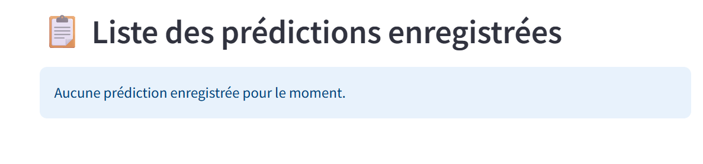

# Ticket d'incident 4

## Étapes pour reproduire le problème
1. A la première utilisation, lorsqu'il n'y a aucune prédiction.
2. Lancer l'application.
3. Ajouter une image satellite du désert sur la page *Upload image*.
4. *Envoyer*
6. Passer sur la page *Voir les prédictions*.
7. La *Liste des prédictions enregistrées* est vide.

## Résultat actuel
Malgré l'ajout d'une première prédiction, la *Liste des prédictions enregistrées* affiche *Aucune prédiction enregistrée pour le moment.*.



## Comportement attendu
La *Liste des prédictions enregistrées* doit afficher la première *prédiction*.

---

# Correction

**Date de la correction : 7 octobre 2026**

### Cause du bug
Dans `api/app/bdd/service.py`, la méthode `lister_predictions` retirait systématiquement la dernière ligne renvoyée par la base de données (table *predictions*)  :

``` python
length = len(rows)-1
return [Prediction(**row) for row in rows[:length]]
```

Avec une seule prédiction, `length` valait 0 et la liste renvoyée était vide. Avec N prédictions, seules N-1 étaient affichées : le bug touchait donc toutes les prédictions, pas uniquement la première.

### Correction apportée
La liste est maintenant construite à partir de toutes les lignes :

``` python
return [Prediction(**row) for row in rows]
```

### Autres modifications
- **Tests unitaires** (`api/tests/`, `pytest`) : tests de non-régression avec une base simulée (`unittest.mock`). Avec le bug, 4 tests échouent ; avec la correction, les 6 passent.
- **Contrôle dans le code** : `lister_predictions` écrit un log (`Liste des prédictions OK : N renvoyée(s)`, ou une erreur en cas d'incohérence) et incrémente le compteur `liste_predictions_incoherences_total` si le nombre de lignes renvoyées diffère du nombre de lignes lues.
- **Monitoring** (Prometheus + Grafana, dossier `monitoring/`) : l'API expose `/metrics` (prédictions par classe, durée d'inférence du modèle, requêtes HTTP par code, durée et erreurs de la base, compteur d'incohérences du ticket 4). 
- **Dashboard Streamlit** : nouvelle page *📊 Dashboard* dans la sidebar, qui lit `/metrics`.

### Résumé des fichiers créés ou modifiés

| Fichier | Modification |
|---|---|
| `api/app/bdd/service.py` | **Correction du bug** (`rows[:length]` devient `rows`), logs et compteur d'incohérences |
| `api/app/main.py` | Exposition de `/metrics`, métriques d'inférence du modèle CNN, configuration des logs |
| `api/app/metrics.py` | *Nouveau* : définition des métriques Prometheus et décorateur `mesurer_bdd` |
| `api/tests/` | *Nouveau* : tests unitaires (`test_service.py`, `conftest.py`) |
| `api/pytest.ini` | *Nouveau* : configuration de pytest |
| `api/requirements.txt` | Ajout de `prometheus-client` et `prometheus-fastapi-instrumentator` |
| `client/app.py` | nouvelle page *Dashboard* |
| `client/metrics_utils.py` | *Nouveau* : lecture et calcul des métriques pour le dashboard |
| `client/config.py` | Ajout de `API_METRICS_URL` |
| `client/Dockerfile` | Copie de `metrics_utils.py` |
| `client/requirements.txt` | Ajout de `prometheus-client` |
| `docker-compose.yml` | Ajout des services `prometheus` et `grafana` |
| `monitoring/` | *Nouveau* : `prometheus.yml` (configuration de la collecte des métriques) et `grafana/datasource.yml` (source de données Prometheus configurée automatiquement dans Grafana) |
---
# Classification d'images satellites
Cas pratique sur un CNN

## Cas pratique
C'est un travail individuel qui est attendu de vous. Chaque apprenant devra présenter un rapport personnel, du code personnel et un dashboard personnel. Lisez bien toutes les consignes avant de commencer.

## Compétences visées
- C.20 : Surveiller une application d’intelligence artificielle
- C.21 : Résoudre les incidents techniques

Ces deux compétences sont validées par l'épreuve E5.

## Travail à réaliser
Avant de commencer la résolution du ticket, commencez par lire les attendus du rapport, pour pouvoir relever toutes les informations attendues aux bons moments. 

- Tracez le bug en utilisant les outils de debug et les points d'arrêt.
- Corrigez le bug et testez la solution.
- Mettez à jour la branche avec la correction documentée.
- Ajoutez des contrôles dans le code pour remonter des informations sur le nouveau code.
- Ajoutez un dashboard pour assurer le suivi de l'application.
- Une des métriques doit permettre le suivi du modèle.
- Ajoutez la documentation du dashboard.
- Redéployez, un merge, la solution sur votre dépôt GitHub.
- Rédigez votre rapport.

## Rapport
Le rapport compte entre 2 et 5 pages.

- Présentation de l'application.
- Présentation de l'incident technique.
- Présentez le message d'erreur en console et expliquez-le.
- Expliquez les recherches faites pour résoudre l'incident technique.
- Expliquez la correction apportée et le test de validation.
- Expliquez le versionnage de la correction dans Git et le déploiement sur GitHub.
- Ajoutez la documentation sur le dashboard en expliquant le choix des métriques, le choix de la technologie, la mise à jour des indicateurs et les alertes.


## Les tickets d'incident
Chaque branche représente un ticket d'incident. Il y a 4 branches, donc 4 tickets.

Les tickets sont répartis de la façon suivante : 
- ticket 1 : Corto Gayet, Khaoula Mili
- ticket 2 : Carole Novak, Simon Brouard, Nathalie Bediée
- ticket 3 : Malgorzata Ryczer-Dumas, Tangi le Cadre, Lucas Henneuse 
- ticket 4 : Lucie Jouan, Hugo Babin, Mathieu Laronce

Vous trouverez toutes les informations du ticket dans le Readme de la branche.

## Installation
Merci de ne rien modifier sur ce dépôt.

1. Faire un fork ou un clone de la branche qui vous intéresse sur votre dépôt GitHub. Créez une branche pour la correction.
2. Installer Git en local. Récupérer le projet sur votre machine.
3. Le dossier `tests` contient des images satellite.

## Démarrage avec Docker

Depuis la racine du projet, vérifier les valeurs du fichier `.env`, puis lancer :

```powershell
docker compose up --build -d
```
| Service | Adresse par défaut |
| --- | --- |
| Client Streamlit | http://localhost:8501 |
| Documentation API | http://localhost:8081/docs |
| Adminer | http://localhost:8080 |
| MySQL | localhost:3306 |

Dans Adminer, utiliser le serveur `db` et les valeurs `MYSQL_USER`,
`MYSQL_PASSWORD` et `MYSQL_DATABASE` du `.env`.

```powershell
docker compose logs -f
docker compose down
```

Les données MySQL sont conservées dans `databases/`, et les images reçues dans
`api/satelite_images/`. `data/db/init.sql` est exécuté uniquement lors de la
création d'une base sur un dossier de données vide. Modifier les identifiants
dans `.env` ne modifie pas les comptes d'une base déjà initialisée.

## Configuration

Compose lit automatiquement le `.env` à la racine pour les identifiants et les
ports publiés. Il transmet à chaque application uniquement les variables dont
elle a besoin. Les connexions entre conteneurs utilisent `db:3306` et `web:80`,
indépendamment des ports publiés sur la machine.

Les configurations Python chargent ce même `.env` avec `python-dotenv` pour un
lancement local, sans écraser les variables déjà présentes dans l'environnement.
Les identifiants MySQL n'ont aucune valeur par défaut dans le code Python.
`DB_HOST`, `DB_PORT` et `API_BASE_URL` servent aux connexions locales ; Compose
les remplace par les adresses internes appropriées.

Si `API_PORT` change, adapter aussi `API_BASE_URL` pour le client lancé localement.
`UPLOAD_FOLDER` est relatif au dossier `api/` en local ; Compose fixe son chemin
au dossier persistant monté dans le conteneur.

L'API attend que MySQL soit prêt. Après modification des dépendances, relancer `docker compose up --build -d`.

## Lancement Python local

Avec Python 3.11 et les dépendances installées dans un environnement virtuel,
lancer MySQL et Adminer avec `docker compose up -d db adminer`, puis :

```powershell
cd api
python -m pip install -r requirements.txt
python -m uvicorn app.main:app --host 127.0.0.1 --port 8081
```

Dans un deuxième terminal depuis la racine :

```powershell
cd client
python -m pip install -r requirements.txt
python -m streamlit run app.py
```

Adapter le port Uvicorn si `API_PORT` a été modifié.
